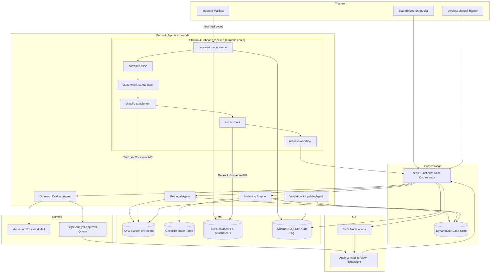

# Design Document: Client Outreach Agent

## Overview

The Client Outreach Agent is an event-driven, multi-agent system built on AWS that automates KYC remediation outreach. It is decomposed into five cooperating agents/services orchestrated by a case-state machine, backed by a rules engine for checklist logic, and gated by a hybrid human-approval layer for anything outside "standard case" bounds.

The AI-driven agent components are hosted on **Amazon Bedrock AgentCore** (Runtime + Gateway + Memory) for Streams 2, 3, and 5. AgentCore Runtime executes agent logic and tool calls; AgentCore Gateway handles invocation routing from Step Functions and Lambda; AgentCore Memory provides persistent cross-conversation context for multi-day, multi-turn client cases. **Stream 4** (inbound email processing) is implemented as a **sequential Lambda pipeline** that calls Amazon Bedrock directly via the Converse API — it does not use AgentCore Runtime, Gateway, or Memory, instead fetching case context directly from DynamoDB. Business/lifecycle state (case status, SLA timers, follow-up counts) remains owned by the DynamoDB `Cases` table — these are separate concerns deliberately kept separate (see Component 1 and state ownership note below).

Design principles:
- **Deterministic where possible, generative where it adds value.** Checklist matching, validation rules, and approval-routing are deterministic (rules engine / code), not left to LLM judgment. LLMs are used for email drafting, free-text/attachment interpretation, and classification confidence scoring — exactly the parts that benefit from language understanding.
- **Fail safe, not silent.** Any low-confidence or error condition halts automation for that case and escalates, per Requirement 12.
- **Everything is auditable.** Every state transition is an event written to an append-only log.
- **PII stays inside the approved boundary.** No customer PII leaves the AWS account boundary / approved Bedrock models.

## Architecture



### Why Step Functions as orchestrator (not a single monolithic agent)

KYC remediation is a long-running, multi-day, multi-turn process (send → wait for reply → maybe follow up → wait again → close). A Step Functions state machine models this naturally as a case lifecycle with explicit wait states, retries, and escalation transitions, while each AgentCore agent handles a bounded, well-defined cognitive task. This also satisfies Requirement 12 (fail-safe halts) and Requirement 10 (auditable state transitions) far more cleanly than an autonomous agent looping indefinitely.

### State ownership: DynamoDB Cases table vs AgentCore Memory

These two stores are deliberately separate and own different things:

| Store | Owns |
|---|---|
| DynamoDB `Cases` table | Business/lifecycle state: case status, SLA due date, follow-up count, escalation reason, SFN task token, gap analysis result, outstanding requirements. Queried by Step Functions, Lambda (including Stream 4 pipeline), and the analyst view. |
| DynamoDB `InboundMessages` table | Inbound email processing state: message_id, sender, subject, correlation status, case_id (post-correlation), attachment count, headers. Written by Stream 4's receive-inbound-email and correlate-case Lambdas. |
| AgentCore Memory | Conversational context: what was communicated to this client, what they replied, what the agent understood across multiple email exchanges. Retrieved by AgentCore agents (Streams 2, 3, 5) at invocation time to avoid reconstructing context from audit logs on every turn. **Not used by Stream 4** — the Lambda pipeline reads case context directly from the Cases table. |

The Cases table is the source of truth for "where is this case in the process." AgentCore Memory is the source of truth for "what has been said and understood in this client conversation." Neither replaces the other.

## Components and Interfaces

### 1. Case Orchestrator (AWS Step Functions)
Owns the case lifecycle state machine: `NEW → DATA_RETRIEVED → GAP_ANALYZED → OUTREACH_DRAFTED → [AUTO_SENT | PENDING_APPROVAL] → AWAITING_RESPONSE → RESPONSE_RECEIVED → [COMPLIANT | FOLLOW_UP_NEEDED | ESCALATED] → CLOSED`.
- Triggered by: EventBridge schedule (periodic sweep for new/aging cases), inbound mail event, or analyst manual action.
- Persists state to DynamoDB `Cases` table on every transition.
- Emits an audit event on every transition (Requirement 10.1).
- Enforces SLA timers (Requirement 12.3) via Step Functions wait states + EventBridge timeout rules.
- **`AWAITING_RESPONSE` wait state:** implemented as a `.waitForTaskToken` Step Functions task. The task token is written to `Cases.sfn_task_token` when the state is entered and cleared on resume. The Stream 4 inbound pipeline's `resume-workflow` Lambda uses this token to call `sfn:SendTaskSuccess`/`sfn:SendTaskFailure` and resume the case (see Component 5). The wait state has a heartbeat/timeout equal to the configurable customer-response window (default 10 business days, per Requirement 12.3); on timeout, the orchestrator transitions directly to `ESCALATED`.

### 2. Retrieval Agent (AgentCore Runtime + Gateway, tool-calling)
- Hosted on **AgentCore Runtime**; invoked by Step Functions via **AgentCore Gateway**.
- Uses **AgentCore Memory** to retain previously retrieved profile context for the client, avoiding redundant KYC source calls within a case lifecycle.
- **Tool:** `get_kyc_profile(client_id)` — calls the KYC system of record's API/DB adapter.
- Normalizes response into the canonical `KycProfile` schema (Requirement 1.3).
- On failure: raises a typed error consumed by the orchestrator, which routes to analyst notification (Requirement 1.2) rather than retrying indefinitely.
- Applies a 24h TTL cache in DynamoDB keyed by `client_id` (Requirement 1.4).

### 3. Checklist Rules Engine (Lambda, deterministic — not an LLM)
- Data-driven rule table in DynamoDB (`ChecklistRules`), keyed by `(client_type, jurisdiction, risk_rating)` → list of required `requirement_type` codes with metadata (expiry rules, validity window).
- Rule changes go through a versioned write path with `updated_by` / `updated_at` (Requirement 2.2) — for v1, applied via a config/script-driven update path rather than direct table edits or a dedicated rule-management UI (that UI is deferred, see design's Analyst Insights View note and Open Items).
- Falls back to `DEFAULT_BASELINE` ruleset + flags case `NEEDS_RULE_REVIEW` when no rule matches (Requirement 2.3).
- **Matching Engine** (same component, separate function): diffs `KycProfile.documents/fields` against the resolved checklist, treating expired documents as missing (Requirement 3.2), and emits a structured `GapAnalysisResult`.

### 4. Outreach Drafting Agent (AgentCore Runtime + Gateway + Memory)
- Hosted on **AgentCore Runtime**; invoked by Step Functions via **AgentCore Gateway**.
- Uses **AgentCore Memory** to recall prior outreach history for this client (what was already requested, what tone/language was used, how many times contact has been made) — this context informs follow-up email tone and content without reconstructing it from audit logs each time.
- **Input:** `GapAnalysisResult` + client profile (name, language preference, channel).
- **Tool:** `render_template(template_id, variables)` — the agent selects an approved template from a template library (S3/DynamoDB) and populates variables; it does not free-generate the entire email body (Requirement 4.3). This bounds hallucination risk in a customer-facing regulated communication.
- Attaches a unique `case_ref` token embedded in the subject line and a hidden header (`X-Case-Ref`) for reply correlation (Requirement 4.2, 6.2).
- **Standard-case classifier** (deterministic rule, not LLM): evaluates dispatch-eligibility criteria (risk rating, follow-up count, known client, template match) to output `AUTO_SEND` or `NEEDS_APPROVAL` (Requirement 5.1, 5.2). Keeping this rule deterministic and reviewable is a deliberate compliance choice.
- `AUTO_SEND` → publishes to SES send Lambda. `NEEDS_APPROVAL` → writes to SQS approval queue, surfaced on the Analyst Insights View (Requirement 5.2, 9.2).
- Enforces minimum re-contact interval per client (Requirement 12.2).

### 5. Inbound Processing Pipeline (Lambda chain — Stream 4)

Stream 4 is implemented as a **sequential Lambda pipeline**, not an AgentCore Runtime agent. Each step is a standalone Lambda function that receives input from the previous step and produces output for the next. The pipeline does **not** use AgentCore Runtime, Gateway, or Memory — it calls Amazon Bedrock directly via the Converse API for classification and extraction, and fetches case context directly from the DynamoDB `Cases` table.

**Pipeline sequence:** `receive-inbound-email` → `correlate-case` → `attachment-safety-gate` → `classify-attachment` → `extract-data` → `resume-workflow`

**5a. Receive Inbound Email** (Lambda, triggered by S3 event)
- Triggered when SES deposits a raw `.eml` file into the `inbound-emails/` prefix of the documents bucket (S3 event notification).
- Fetches raw email bytes from S3 and parses the MIME structure using Python's `email` module.
- Extracts headers (From, Subject, Date, In-Reply-To, References, X-Case-Ref), plain-text/HTML body, and all attachments.
- Stores each attachment in S3 under `inbound-attachments/{message_id}/{attachment_id}/{filename}`.
- Writes an `InboundMessage` record to the **InboundMessages** DynamoDB table with `correlation_status = PENDING`.
- Emits audit event. Returns parsed metadata (message_id, sender, subject, attachments list, headers) for `correlate-case`.

**5b. Correlate Case** (Lambda, deterministic)
- Extracts `case_id` from inbound email using three strategies in priority order:
  1. `X-Case-Ref` header (most reliable — set by outbound email in Stream 3).
  2. Subject line pattern match (`CASEREF-<case_id>`).
  3. `In-Reply-To` / `References` headers (reverse lookup — TODO for edge cases).
- Looks up the case in the `Cases` table; checks for `AWAITING_RESPONSE` status.
- **On match:** updates `InboundMessage` record with `case_id` and status `MATCHED`; returns `case_id`, `client_id`, `sfn_task_token`, and attachments for downstream.
- **On failure:** routes to `ManualTriageQueue` (SQS) for analyst review, marks `InboundMessage` as `UNMATCHED` (Requirement 6.3).

**5c. Attachment Safety Gate** (Lambda, deterministic)
- **Allowed file types:** PDF, JPEG, PNG only. DOCX is **not** supported.
- **Minimum file size:** 1 KB (rejects empty/corrupt files).
- **Maximum file size:** 4 MB (configurable via `MAX_FILE_SIZE_BYTES` env var).
- Extension vs content-type consistency check (e.g., `.pdf` must match `application/pdf`).
- Blocked dangerous extensions list (`.exe`, `.bat`, `.cmd`, `.ps1`, `.js`, `.jar`, etc.).
- Failing attachments are quarantined: copied to `quarantine/` prefix in S3 with rejection-reason tagging. Original file remains in place for analyst review.
- **No malware scanning integration yet** — ClamAV/GuardDuty integration is noted as future work.
- Passes `safe_attachments` list to `classify-attachment`; returns `quarantined_attachments` for audit visibility.

**5d. Classify Attachment** (Lambda, calls Bedrock directly)
- Uses **Amazon Bedrock** (Claude 3 Sonnet via Converse API) for multimodal document classification. Does **not** use AgentCore Runtime or Gateway.
- Fetches outstanding requirements from the `Cases` table to provide classification context (biases toward expected document types for the case).
- Sends document bytes + classification prompt to Bedrock. Model returns a JSON response with `classification` (requirement type) and `confidence` score.
- Known requirement types: `PASSPORT`, `NATIONAL_ID`, `PROOF_OF_ADDRESS`, `CERTIFICATE_OF_INCORPORATION`, `CERTIFICATE_OF_GOOD_STANDING`, `SOURCE_OF_FUNDS_DECLARATION`, `BANK_STATEMENT`, `TAX_CERTIFICATE`, `BENEFICIAL_OWNERSHIP_DECLARATION`, `POWER_OF_ATTORNEY`, `OTHER`.
- Returns `classified_attachments` list with per-attachment classification and confidence.

**5e. Extract Data** (Lambda, calls Bedrock directly)
- Uses **Amazon Bedrock** (Claude 3 Sonnet via Converse API) for structured field extraction. Does **not** use Amazon Textract.
- Per-document-type extraction schemas define expected fields (e.g., PASSPORT expects `full_name`, `date_of_birth`, `nationality`, `passport_number`, `issued_at`, `expires_at`, `issuing_country`).
- Sends document bytes + extraction prompt to Bedrock. Model returns extracted fields + confidence.
- **Confidence adjustment:** raw model confidence is adjusted by field coverage (penalises missing fields). Formula: `adjusted_confidence = raw_confidence * (0.5 + 0.5 * coverage)` where coverage = proportion of expected fields with non-null values.
- Returns `extracted_attachments` list with per-attachment fields and adjusted confidence.

**5f. Resume Workflow** (Lambda, integration point with Stream 5)
- Applies configurable confidence thresholds from environment variables:
  - Classification: `CLASSIFICATION_CONFIDENCE_THRESHOLD` (default 0.75)
  - Extraction: `EXTRACTION_CONFIDENCE_THRESHOLD` (default 0.70)
- **All pass:** calls `sfn:SendTaskSuccess` with the inbound result payload to resume the Stream 5 state machine, then clears the consumed task token from the `Cases` table.
- **Low confidence on any attachment:** routes to analyst review queue (SQS `ANALYST_REVIEW_QUEUE_URL`) with details of which items failed and why.
- **No task token found:** escalates (case not in expected `AWAITING_RESPONSE` state).
- This is the critical integration point between Stream 4 (inbound processing) and Stream 5's state machine (paused at `StoreTaskTokenAndAwait`). The explicit token-passing pattern ensures the orchestrator — not the pipeline — owns state transitions (see Component 1).

### 6. Validation & Update Agent (Lambda, deterministic)
- Validates extracted data against the specific checklist requirement (expiry, name match to client record, required field completeness) (Requirement 6.5).
- On pass: writes update to KYC system of record via adapter, retains original document in S3 (Requirement 8.1, 8.2).
- On failure/retry-exhaustion: alerts analyst (Requirement 8.3).
- Triggers re-run of Matching Engine to determine remaining gaps → feeds follow-up loop (Requirement 7.1) or case closure (Requirement 7.3, 3.4).
- Enforces `max_follow_up_cycles` (default 3) and escalates on limit (Requirement 7.4).

### 7. Analyst Insights View (v1: Lambda-backed script; fast-follow: Amplify + Cognito web app)

**v1 — Lambda-backed script (current scope):**
A lightweight Python script or notebook that invokes a set of Lambda functions directly (via AWS CLI / boto3) to read from the `Cases` and `Audit` tables and write approval/rejection actions back to the SQS queue. No auth layer, no frontend hosting pipeline — runs within the existing trusted analyst environment. Lambda functions backing the script are the same functions Amplify will call in the fast-follow, so no backend work is thrown away.

**Fast-follow — Amplify + Cognito (post first end-to-end demo):**
Once the pipeline is proven end-to-end and demoable, Stream 6 upgrades the frontend to an Amplify-hosted React app with Cognito user pool auth. The Lambda backend is unchanged; the upgrade is purely the frontend layer (Amplify hosting, Cognito auth flow, React UI replacing the script). This is the deliberate sequence: get everything working and integrated first with the cheapest possible frontend, then replace just the frontend layer once the backend is stable.

**v1 scope (what gets built now):**
- Case list/detail views per Requirement 9.1: profile, checklist applied, gap analysis, outreach history, inbound responses, extraction confidence, status.
- Approve/edit/reject action for `NEEDS_APPROVAL` outreach (Requirement 5.3, 5.4) — same Lambda-backed script, writes decision back to SQS approval queue.
- Escalation reason surfaced explicitly per case (Requirement 9.2).
- Filter/sort by status and risk rating (Requirement 9.4).
- Runs within the existing trusted environment for v1 — no separate auth layer. Amplify + Cognito frontend is the deliberate fast-follow once end-to-end pipeline is demoable (see Open Item #6).

### 8. Audit & Notification Layer
- Every component writes structured events to an **audit event bus** (EventBridge) → persisted to an append-only store (DynamoDB with stream → S3/Glacier for long-term retention, or Amazon QLDB if cryptographic verifiability is required).
- Export function generates a case-scoped audit report (PDF/CSV) on demand (Requirement 10.3).
- SNS/insights-view notifications to the responsible analyst on any case requiring action (Requirement 9.3).

## Data Models

```
KycProfile
- client_id
- client_type, jurisdiction, risk_rating
- fields: { field_name -> { value, source, updated_at } }
- documents: [ { doc_type, doc_id, issued_at, expires_at, s3_ref } ]
- preferred_language, preferred_channel
- retrieved_at

ChecklistRule
- rule_id, version
- match: { client_type, jurisdiction, risk_rating }
- required: [ { requirement_type, validity_window_days, mandatory: bool } ]
- updated_by, updated_at

GapAnalysisResult
- case_id, client_id
- outstanding: [ { requirement_type, reason: MISSING|EXPIRED|INCOMPLETE } ]
- computed_at

Case (DynamoDB primary table)
- case_id (PK), client_id
- status (state machine value)
- follow_up_count
- risk_flags, escalation_reason
- sfn_task_token (nullable — set when AWAITING_RESPONSE, cleared on resume)
- created_at, updated_at, sla_due_at

OutreachEmail
- email_id, case_id
- template_id, rendered_body_ref
- dispatch_mode: AUTO_SEND | NEEDS_APPROVAL
- approved_by (nullable), sent_at, delivery_status

InboundMessage (DynamoDB: InboundMessages table)
- message_id (PK)
- case_id (nullable pre-correlation, set by correlate-case on match)
- sender, subject, received_at, raw_ref (S3 key of original .eml)
- correlation_status: PENDING | MATCHED | UNMATCHED
- attachment_count
- headers: { from, subject, date, in_reply_to, references, x_case_ref }
- updated_at

AuditEvent
- event_id, case_id, actor (agent_name | analyst_id), action, timestamp,
  input_ref, output_ref
```

## Error Handling

| Failure | Handling |
|---|---|
| KYC source system unavailable | Retry w/ backoff (3x) → mark case `BLOCKED`, notify analyst (Req 1.2) |
| No checklist rule match | Apply baseline + flag `NEEDS_RULE_REVIEW` (Req 2.3) |
| Low classification/extraction confidence | Route to analyst review queue (SQS) via resume-workflow; halt automation for that case (Req 6.6, 12.1). Thresholds: classification ≥ 0.75, extraction ≥ 0.70 (configurable via env vars). |
| Unsupported/unsafe attachment | Quarantine to `quarantine/` S3 prefix with rejection-reason tag; do not process; audit logged (Req 6.7, 11.4). Allowed types: PDF, JPEG, PNG only; max 4 MB. |
| Uncorrelated inbound email | Route to `ManualTriageQueue` (Req 6.3) |
| KYC record update fails | Retry per policy → alert analyst on exhaustion (Req 8.3) |
| Email bounce/delivery failure | Update `delivery_status`, surface on insights view, do not silently retry indefinitely |
| Follow-up cycle limit reached | Force escalation to analyst (Req 7.4) |
| SLA breach | Force escalation regardless of automation state (Req 12.3). Two configurable thresholds: customer response window (default 10 business days from outreach send) and overall case age (default 30 business days from case open). Implemented as Step Functions `.waitForTaskToken` timeout on `AWAITING_RESPONSE` and a separate EventBridge scheduled rule for overall case age. |

All escalation paths converge on the same mechanism: set `Case.status = ESCALATED` (or a review sub-state), write `escalation_reason`, emit SNS notification, surface on the insights view. This keeps exception handling uniform and easy to audit.

## Performance and Scalability

- **Case isolation:** each case is a distinct Step Functions execution with its own DynamoDB item (`case_id` partition key) and its own audit-event stream — concurrent cases share no mutable in-memory state, satisfying Requirement 13.1.
- **Horizontal scale:** Lambda concurrency and Step Functions executions scale out automatically with volume (subject to configured account concurrency limits); DynamoDB tables use on-demand or auto-scaled provisioned capacity to absorb campaign-driven spikes (Requirement 13.3).
- **Inbound triage latency:** the SES → S3 event → Lambda pipeline (receive → correlate → safety-gate → classify → extract → resume) path for inbound mail is designed for sub-minute dispatch per step; end-to-end triage/correlation is targeted at minutes, not hours (Requirement 13.2). The Bedrock Converse API calls in classify and extract steps are the primary latency contributors. This target should be validated under load during the pilot.
- **Capacity alerting:** CloudWatch alarms on Lambda throttling, Step Functions execution limits, and DynamoDB throttled requests notify operators before volume silently backs up (Requirement 13.4).

## Security

- **Encryption:** KMS-encrypted S3 buckets and DynamoDB tables; TLS in transit everywhere (Req 11.1).
- **Access control:** IAM least-privilege per Lambda/agent role (Req 11.2). The v1 analyst view runs within the existing trusted environment with no separate auth layer. The deliberate fast-follow is a Cognito user pool-backed Amplify app (no bank IdP required for this step — just standard Cognito auth). Full bank IdP federation with role-based multi-analyst access is further future work beyond the fast-follow (see Open Items).
- **LLM boundary:** AgentCore agents (Streams 2, 3, 5) run within the AWS account's VPC/PrivateLink boundary via AgentCore Runtime and Gateway. Stream 4's classify-attachment and extract-data Lambdas call Amazon Bedrock directly via the Converse API (Claude 3 Sonnet) — same account boundary, same approved model, but without AgentCore intermediation. No data sent to non-approved external APIs (Req 11.3). Confirm with the bank's model-risk/compliance team which Bedrock models are approved for PII processing before implementation.
- **Attachment safety:** file-type allowlist (PDF/JPEG/PNG — DOCX not supported), 4 MB max size, extension/content-type consistency check, dangerous extension blocklist, quarantine on failure. Malware scanning (ClamAV/GuardDuty) is noted as future work (not yet wired).
- **Template constraint on generation:** outbound customer emails are template-bounded (see Component 4) specifically to reduce prompt-injection and hallucination risk in a regulated, customer-facing channel — this is both a security and compliance control.
- **Prompt injection consideration:** inbound email/attachment content is treated as untrusted input to the Stream 4 Lambda pipeline (classify-attachment and extract-data steps); extraction/classification outputs are validated deterministically by the resume-workflow step (confidence thresholds) and downstream by Component 6 (Validation & Update) before any KYC record write, so LLM output never directly mutates the system of record without a rules-based check.

## Testing Strategy

- **Unit tests:** rules engine matching logic, validation rules, template rendering, correlation logic — deterministic, high coverage.
- **Agent evaluation:** golden-set test emails/attachments (including edge cases: expired docs, wrong document type, low-quality scans, non-English content, malicious file types) run against the Stream 4 Lambda pipeline with confidence-threshold assertions. Classification and extraction accuracy measured against labelled ground-truth documents via Bedrock Converse API responses.
- **Integration tests:** end-to-end case lifecycle in a sandbox mailbox against a mocked KYC system of record.
- **Human-in-the-loop UAT:** analysts review a shadow-mode pilot (agent drafts/classifies but nothing auto-sends) before enabling `AUTO_SEND` in production, to validate the standard-case criteria are calibrated correctly.
- **Compliance review:** legal/compliance sign-off on the approved email template library before go-live (ties to Req 4.3).

## Open Items / Assumptions to Confirm

1. Identity of the specific "KYC system of record" and its API/integration contract (assumed generic adapter above).
2. Approved Bedrock model(s) for PII-bearing workloads — pending model-risk approval. Stream 4 currently uses `anthropic.claude-3-sonnet-20240229-v1:0` for classification and extraction.
3. Definition of "standard case" auto-send criteria — proposed in this design but must be compliance-approved before enabling Requirement 5.1 autonomy.
4. Whether QLDB (cryptographically verifiable ledger) is required for audit, or DynamoDB+S3 append-only pattern is sufficient for regulatory needs — depends on the bank's audit standards.
5. Multi-language template coverage scope (Requirement 4.4) — which languages are in scope for v1.
6. Amplify + Cognito analyst dashboard (fast-follow): v1 uses a Lambda-backed script for the analyst view. The deliberate fast-follow is to replace the script frontend with an Amplify-hosted React app backed by Cognito user pool auth, reusing the same Lambda functions. Timing: after first end-to-end demo proves the pipeline. Full production dashboard (bank IdP federation, multi-analyst role management) is further future work beyond the fast-follow.
7. **Malware scanning integration (Stream 4):** ClamAV Lambda layer or GuardDuty Malware Protection is not yet wired into the attachment-safety-gate. Currently only file-type, size, and extension checks are enforced. Malware scanning is noted as future work.
8. **Confidence threshold configuration (Stream 4):** Currently configured via Lambda environment variables (`CLASSIFICATION_CONFIDENCE_THRESHOLD=0.75`, `EXTRACTION_CONFIDENCE_THRESHOLD=0.70`). A future improvement could move these to SSM Parameter Store for runtime tuning without redeployment.
9. **DOCX support (Stream 4):** The safety gate currently rejects DOCX files. If DOCX support is needed, it would require adding the MIME type to the allowlist and validating Bedrock's multimodal handling of DOCX format.
